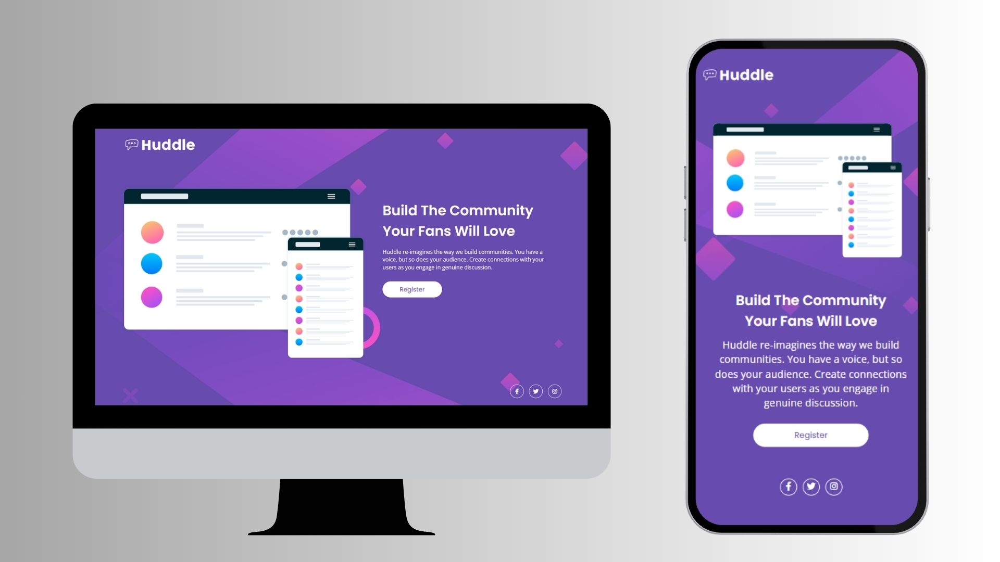

# Huddle Landing Page (Frontend Mentor Challenge) 🚀

 Este projeto consiste na implementação de uma landing page responsiva para a Huddle, uma empresa especializada na construção de comunidades online. Desenvolvido como parte de um desafio do Frontend Mentor, o objetivo principal foi replicar com precisão o design proposto, garantindo fidelidade visual e adaptabilidade total a diversas viewports.

## Visão Geral do Projeto💡

A landing page exibe informações cruciais sobre os serviços da Huddle, incluindo uma seção introdutória, detalhes de funcionalidades, e elementos interativos como links para redes sociais. O desafio técnico focou em:

👉 Construção de uma estrutura HTML semântica e acessível.

👉 Implementação de um layout CSS sofisticado, utilizando Flexbox para organização e posicionamento de elementos.

👉 Gerenciamento e otimização de recursos visuais (imagens e ícones).

👉 Garantia de responsividade através de media queries, proporcionando uma experiência de usuário otimizada tanto em desktops quanto em dispositivos móveis.

👉 Configuração de links para redes sociais, assegurando a navegabilidade para as plataformas externas da empresa.

## Tecnologias utilizadas:

 
    
     
    
